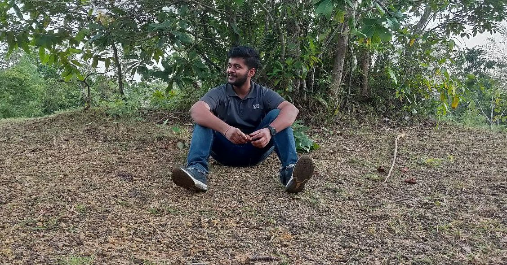
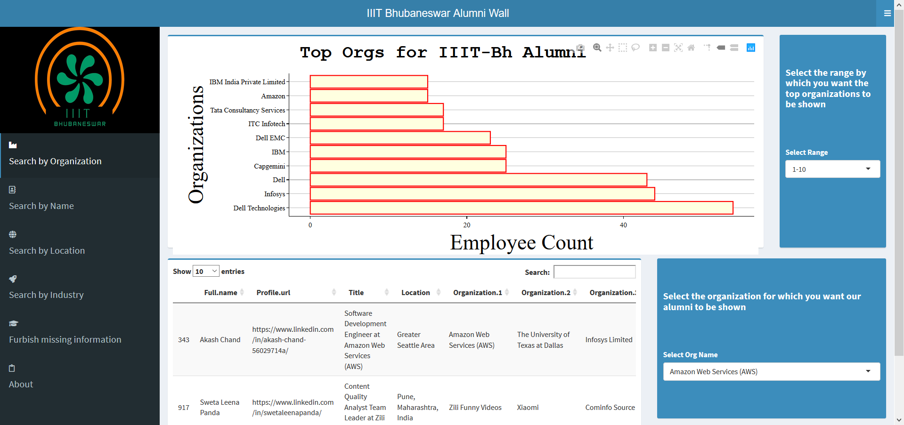
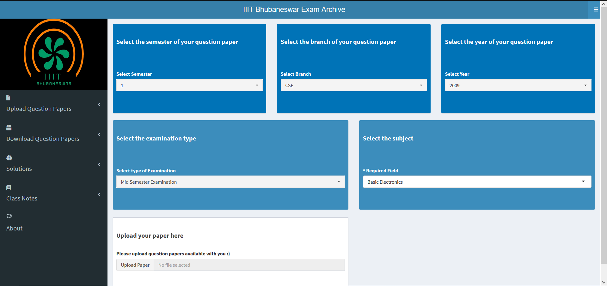

# Welcome to my digital backyard ;)

Hello World!! I am Rahul Saxena, a final year computer science undergraduate at IIIT Bhubaneswar. I simply love to learn and explore the core fundamentals of Computer Science and yet keeping tabs on the latest developments in computer science. Few highlights of my college life, where my love affair with computers started:
  - [Google Summner of Code 2020 Student Developer with R Project for Statistical Computing](https://summerofcode.withgoogle.com/projects/#6187591176552448/)
  - [Cyber Security Speaker for the Govt of Odisha under CDAC and ISEA](https://twitter.com/hindu_bale/status/1214511636779696130?s=09)
  - [Co-Founder of Information Security Society of IIIT-Bhubaneswar](https://www.facebook.com/ACMIIITBh/posts/3165433630167350)
  - [Summer Research Intern at IIT Patna](https://hindubale.github.io/Rahul_Cert(1).PDF)

# Where do I hang out ?

For informal yet passionate discussions on Anime, Boxing, MMA, Cricket and the Stock Market, let's catch up on [Instagram](https://www.instagram.com/saxenism/)

For more professional discourse, I prefer these:
* I blog about my learnings [on Medium](https://medium.com/@rahulsaxena.hindubale)
* I dish out developer puns and some solid development thread [on Twitter](https://twitter.com/hinduBale) 
* I love connecting with like-minded people and awesome company reps [on LinkedIn](https://www.linkedin.com/in/saxena-rahul/)
* I am also looking for employment opportunites as a SDE, so [here's my resume](https://hindubale.github.io/RahulSaxena_Resume.pdf)
* I would love to hear from you. [Shoot me a mail](mailto:rahulSaxena.hinduBale@gmail.com) 

# My Pet Projects:
  
  I am firm believer in practical knowledge. While it's alright to posess a theoretical and higher-level understanding of things, we should never be limited to that itself. So here are some of my projects that I have worked on, both the good and the bad :D

## 1. IIIT Bhubaneswar Alumni Wall

With the vision of gaining insights on the alumni from our college and helping the students of our college to get in touch with the alumni at the appropriate positions, I built this **Alumni Wall**.

* A Detailed blogpost can be found [here](https://towardsdatascience.com/battling-covid-19-with-data-science-as-a-university-student-ffcb9304b4c?source=friends_link&sk=69e2db76eaa72bb837a2a9b6fa857223)
* You can check out the project [here](https://studentsofiiitbh.team/alumniwall/)
* The source code is available [here](https://github.com/hinduBale/iiit-bh_alumni_wall/)

## 2. IIIT Bhubaneswar Exams Archive

Often in an autonomous institute like ours, the previous year question papers of the mid-terms and end-terms give us a good idea as to what can be expected in the upcoming papers. So, with the aim to create a central platform for all exam-preparation resources, I created **The Exams Archive**.

* A Detailed blogpost can be found [here](https://towardsdatascience.com/creating-an-exam-archive-system-with-a-data-scientists-toolkit-a080d497a9a0?source=friends_link&sk=510d86233ad78639bc201243db31adc1)
* You can check out the project [here](https://studentsofiiitbh.team/examarchive/)
* The source code is available [here](https://github.com/hinduBale/iiit-bh_exam_archive)
